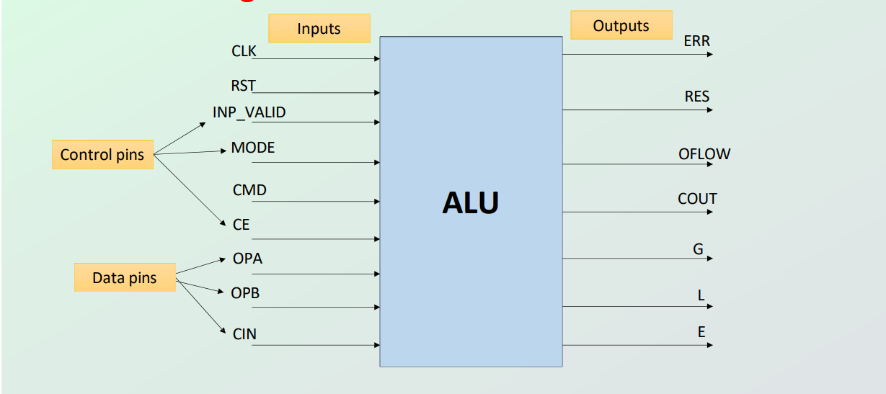

# Eight-Bit Parameterized ALU — Verification Report

---

**Author Name:** Shreesha Kumar M G

**Employee ID / Roll Number:** 6932

**Project Title:** Eight-Bit Parameterized ALU — RTL Design & Functional Verification

---

## Table of Contents

1. [Project Introduction](#1-project-introduction)
2. [Objectives](#2-objectives)
3. [Design Architecture](#3-design-architecture)
   - 3.1 [Architecture Overview](#31-architecture-overview)
   - 3.2 [Inputs](#32-inputs)
   - 3.3 [Outputs](#33-outputs)
   - 3.4 [Block Diagrams](#34-block-diagrams)
   - 3.5 [Timing Behaviour of the DUT](#35-timing-behaviour-of-the-dut)
4. [Supported Operations](#4-supported-operations)
   - 4.1 [Arithmetic Operations (MODE = 1)](#41-arithmetic-operations-mode--1)
   - 4.2 [Logical Operations (MODE = 0)](#42-logical-operations-mode--0)
5. [Working of the Design](#5-working-of-the-design)
6. [Testbench Architecture](#6-testbench-architecture)
7. [Testbench Components](#7-testbench-components)
   - 7.1 [Clock Generator](#71-clock-generator)
   - 7.2 [Driver / Stimulus Block](#72-driver--stimulus-block)
   - 7.3 [Reference Model](#73-reference-model)
   - 7.4 [Monitor & Scoreboard](#74-monitor--scoreboard)
   - 7.5 [Timing Behaviour of the Testbench](#75-timing-behaviour-of-the-testbench)
8. [Quality of Code Assessment](#8-quality-of-code-assessment)
9. [Simulation Results](#9-simulation-results)
10. [Waveforms](#10-waveforms)
11. [Coverage Report](#11-coverage-report)
12. [Conclusion](#12-conclusion)
13. [Future Work](#13-future-work)

---

## 1. Project Introduction

This project presents the RTL design and functional verification of an **eight-bit parameterized Arithmetic Logic Unit (ALU)**. An ALU is the central computational component of any digital processor, responsible for performing arithmetic and logical operations on binary operands. The design is implemented in synthesizable Verilog HDL and is structured to be fully parameterized, allowing the data width, command width, and output width to be configured at elaboration time without modifying the core logic.

The ALU supports two distinct operational modes — **Arithmetic Mode** and **Logical Mode** — controlled by a single `MODE` signal. Within each mode, a 4-bit command bus (`CMD`) selects one of up to 13 distinct operations, covering standard arithmetic (addition, subtraction, increment, decrement, comparison, signed arithmetic, and multiplication variants) as well as bitwise and shift/rotate logical functions.

Verification is carried out using a directed, self-checking Verilog testbench. The testbench instantiates both the Design Under Test (DUT) and a behavioural **reference model**. Outputs from the DUT are compared cycle-accurately against the reference model. Input validity control (`INP_VALID`) is exercised across all four combinations to confirm the error-handling behaviour of the design. Two specific arithmetic commands (MUL_AB and SHIFT_MUL) introduce intentional pipeline latency of two clock cycles, and the testbench accounts for this explicitly.

---

## 2. Objectives

- Study and document the architecture of a parameterized 8-bit ALU with separate arithmetic and logical operating modes.
- Implement fully synthesizable RTL Verilog (`Eight_bit_ALU_rtl_design.v`) using clean, lint-friendly coding practices.
- Develop a behavioural reference model (`alu_reference_model.v`) to serve as the golden standard during verification.
- Create a self-checking directed testbench (`alu_testbench.v`) that exercises every command and every `INP_VALID` combination.
- Verify correct handling of corner cases including carry-out, unsigned overflow, signed overflow, boundary values (0x00, 0xFF), and invalid operand conditions.
- Verify the two-cycle latency behaviour for the MUL_AB (CMD=1001) and SHIFT_MUL (CMD=1010) operations.
- Measure and report functional coverage, statement coverage, and branch coverage of the RTL.
- Simulate using industry-standard tools (Vivado / Questa SIM) and capture waveforms for key scenarios.

---

## 3. Design Architecture

### 3.1 Architecture Overview

The DUT is declared as a parameterized module with three parameters:

| Parameter   | Default | Description                    |
|-------------|---------|--------------------------------|
| `width`     | 8       | Operand bit-width              |
| `cmd_width` | 4       | Command bus width              |
| `out_width` | 16      | Result bus width (= 2 × width) |

The internal logic is organized into four `always` blocks:

1. **Combinational decode block** — `always @(*)` — evaluates the selected operation and drives intermediate (`temp_*`) signals based on `MODE`, `CMD`, `INP_VALID`, and operand values.
2. **Registered output block** — `always @(posedge CLK or posedge RST)` — latches the combinational results into the registered outputs on each rising clock edge when `CE` is asserted, with special handling for the two-cycle operations.
3. **MUL_AB cycle counter** (`count`) — `always @(posedge CLK or posedge RST)` — counts 1→2→3→1, generating the two-cycle window for CMD=1001.
4. **SHIFT_MUL cycle counter** (`count1`) — `always @(posedge CLK or posedge RST)` — identical in structure, dedicated to CMD=1010.

---

### 3.2 Inputs

| Signal      | Width       | Description |
|-------------|-------------|-------------|
| `OPA`       | `width`     | Operand A — primary input, used by all arithmetic and most logical operations. |
| `OPB`       | `width`     | Operand B — secondary input, used where a second operand is required. |
| `CLK`       | 1 bit       | System clock. All registered outputs update on the rising edge. |
| `RST`       | 1 bit       | Active-high synchronous reset. Clears all outputs to zero when asserted. |
| `CE`        | 1 bit       | Clock enable. Registered outputs update only when `CE` is high. |
| `MODE`      | 1 bit       | Selects operating mode: `1` = Arithmetic, `0` = Logical. |
| `CIN`       | 1 bit       | Carry-in. Used by ADD_CIN (CMD=0010) and SUB_CIN (CMD=0011). |
| `INP_VALID` | 2 bits      | Operand validity flags. Bit[0] validates OPA, Bit[1] validates OPB. If required operands are flagged invalid, `ERR` is asserted. |
| `CMD`       | `cmd_width` | 4-bit command selector. Selects the operation within the active mode. |

---

### 3.3 Outputs

| Signal  | Width       | Description |
|---------|-------------|-------------|
| `RES`   | `out_width` | 16-bit result register. |
| `COUT`  | 1 bit       | Carry-out flag. Set when unsigned addition produces a carry beyond bit[7]. |
| `OFLOW` | 1 bit       | Overflow flag. Set on unsigned subtraction borrow or signed arithmetic overflow. |
| `G`     | 1 bit       | Greater-than flag. Set when OPA > OPB. |
| `E`     | 1 bit       | Equal flag. Set when OPA == OPB. |
| `L`     | 1 bit       | Less-than flag. Set when OPA < OPB. |
| `ERR`   | 1 bit       | Error flag. Asserted on invalid CMD or when required operands are marked invalid. |

---

### 3.4 Block Diagrams

**Figure 1 — ALU Top-Level Block Diagram**



---

**Figure 2 — Expanded ALU Internal Architecture**


---

**Figure 3 — Testbench Architecture Diagram**


---

### 3.5 Timing Behaviour of the DUT

The ALU is a **synchronous, registered-output** design with clock enable. The majority of operations exhibit **single-cycle latency**: the combinational decode block resolves within the same clock period, and the result is registered on the very next rising edge of `CLK` (provided `CE` is asserted).

Two operations — **MUL_AB** (`CMD = 4'b1001`) and **SHIFT_MUL** (`CMD = 4'b1010`) — are intentionally assigned **two-cycle latency**. During the first cycle (count = 2), `RES` is driven to `{out_width{1'bx}}` indicating the pipeline is busy. On the second cycle (count = 3), the final result is latched into `RES`.

| Condition | Latency | Notes |
|-----------|---------|-------|
| RST asserted | — | All outputs cleared to 0 on rising edge |
| CE = 0 | — | Outputs hold previous registered value |
| Single-cycle operations | 1 clock | All ops except MUL_AB and SHIFT_MUL |
| MUL_AB (CMD=1001) | 2 clocks | RES = X on cycle 1, valid on cycle 2 |
| SHIFT_MUL (CMD=1010) | 2 clocks | RES = X on cycle 1, valid on cycle 2 |

---

## 4. Supported Operations

### 4.1 Arithmetic Operations (MODE = 1)

| CMD      | Mnemonic   | Operation                              | Required INP_VALID | Key Flags      |
|----------|------------|----------------------------------------|--------------------|----------------|
| 4'b0000  | ADD        | RES = OPA + OPB                        | 2'b11              | COUT           |
| 4'b0001  | SUB        | RES = OPA − OPB                        | 2'b11              | OFLOW (borrow) |
| 4'b0010  | ADD_CIN    | RES = OPA + OPB + CIN                  | 2'b11              | COUT           |
| 4'b0011  | SUB_CIN    | RES = OPA − OPB − CIN                  | 2'b11              | OFLOW          |
| 4'b0100  | INC_A      | RES = OPA + 1                          | INP_VALID[0]=1     | —              |
| 4'b0101  | DEC_A      | RES = OPA − 1                          | INP_VALID[0]=1     | —              |
| 4'b0110  | INC_B      | RES = OPB + 1                          | INP_VALID[1]=1     | —              |
| 4'b0111  | DEC_B      | RES = OPB − 1                          | INP_VALID[1]=1     | —              |
| 4'b1000  | CMP        | Unsigned compare OPA vs OPB            | 2'b11              | G, E, L        |
| 4'b1001  | MUL_AB     | RES = (OPA+1) × (OPB+1) [2-cycle]     | 2'b11              | — (2-cycle)    |
| 4'b1010  | SHIFT_MUL  | RES = (OPA << 1) × OPB [2-cycle]      | 2'b11              | — (2-cycle)    |
| 4'b1011  | S_ADD      | Signed RES = OPA + OPB; G, E, L       | 2'b11              | OFLOW, G, E, L |
| 4'b1100  | S_SUB      | Signed RES = OPA − OPB; G, E, L       | 2'b11              | OFLOW, G, E, L |
| default  | —          | ERR asserted                           | —                  | ERR            |

### 4.2 Logical Operations (MODE = 0)

| CMD      | Mnemonic  | Operation                                         | Required INP_VALID         |
|----------|-----------|---------------------------------------------------|----------------------------|
| 4'b0000  | AND       | RES[7:0] = OPA & OPB                              | 2'b11                      |
| 4'b0001  | NAND      | RES[7:0] = ~(OPA & OPB)                           | 2'b11                      |
| 4'b0010  | OR        | RES[7:0] = OPA \| OPB                             | 2'b11                      |
| 4'b0011  | NOR       | RES[7:0] = ~(OPA \| OPB)                          | 2'b11                      |
| 4'b0100  | XOR       | RES[7:0] = OPA ^ OPB                              | 2'b11                      |
| 4'b0101  | XNOR      | RES[7:0] = ~(OPA ^ OPB)                           | 2'b11                      |
| 4'b0110  | NOT_A     | RES[7:0] = ~OPA                                   | INP_VALID[0]=1             |
| 4'b0111  | NOT_B     | RES[7:0] = ~OPB                                   | INP_VALID[1]=1             |
| 4'b1000  | SHR1_A    | RES[7:0] = OPA >> 1                               | INP_VALID[0]=1             |
| 4'b1001  | SHL1_A    | RES[7:0] = OPA << 1                               | INP_VALID[0]=1             |
| 4'b1010  | SHR1_B    | RES[7:0] = OPB >> 1                               | INP_VALID[1]=1             |
| 4'b1011  | SHL1_B    | RES[7:0] = OPB << 1                               | INP_VALID[1]=1             |
| 4'b1100  | ROL_A_B   | Rotate OPA left by OPB[2:0]; ERR if OPB[7:3]≠0   | 2'b11                      |
| 4'b1101  | ROR_A_B   | Rotate OPA right by OPB[2:0]; ERR if OPB[7:3]≠0  | 2'b11                      |
| default  | —         | ERR asserted                                      | —                          |

---

## 5. Working of the Design

The ALU operates across three conceptual phases per clock cycle:

### Phase 1 — Input Phase

Before the rising clock edge, the driver presents stable values on `OPA`, `OPB`, `CMD`, `MODE`, `CIN`, `INP_VALID`, `CE`, and `RST`. The combinational `always @(*)` block is sensitive to all these signals and begins resolving immediately. All intermediate registers (`temp_res`, `temp_cout`, etc.) are initialized to zero at the top of the block to prevent latches.

### Phase 2 — Operation Phase

The combinational block selects the computation based on `MODE` and `CMD`. For arithmetic operations the block checks `INP_VALID` against each command's operand requirements:

- Operations requiring both operands (ADD, SUB, CMP, etc.) assert `ERR` if `INP_VALID ≠ 2'b11`.
- Unary operations on OPA (INC_A, DEC_A, NOT_A, SHR1_A, SHL1_A) require only `INP_VALID[0]`.
- Unary operations on OPB require only `INP_VALID[1]`.

Signed arithmetic (S_ADD, S_SUB) casts operands to `reg signed` before computing, correctly propagating two's-complement sign extension into the 16-bit result. For logical rotate operations, the upper bits of OPB are checked and `ERR` is asserted if any bit above OPB[2:0] is set.

### Phase 3 — Output Phase

On the rising edge of `CLK`, if `RST` is asserted all outputs clear to zero. If `CE` is asserted, the registered output block latches `temp_*` values into the DUT outputs. For MUL_AB and SHIFT_MUL, the cycle counter controls what is driven: `RES` is held as `X` during the intermediate cycle and the computed result is committed on the second clock.

---

## 6. Testbench Architecture

The testbench (`alu_testbench`) follows a **directed, self-checking** verification methodology. It consists of five components wired together in a single flat module:

```
┌─────────────────────────────────────────────────────────────┐
│                      alu_testbench                          │
│                                                             │
│  ┌──────────┐  Stimuli   ┌─────────────────────────────┐   │
│  │  Driver  │───────────▶│  DUT                        │   │
│  │(initial/ │            │  Eight_bit_ALU_rtl_design   │─┐ │
│  │  tasks)  │───────────▶├─────────────────────────────┘ │ │
│  └──────────┘  Stimuli   │  Reference Model              │ │
│       │                  │  alu_reference_model          │ │
│       └─────────────────▶└──────────────┬────────────────┘ │
│                                         │ REF outputs       │
│                          ┌──────────────▼──────────────┐   │
│                          │  Scoreboard                 │   │
│                          │  (compare_outputs task)   ◀─┘   │
│                          └─────────────────────────────┘   │
│                                                             │
│  Clock Generator: forever #5 CLK = ~CLK  (10 ns / 100 MHz) │
└─────────────────────────────────────────────────────────────┘
```

---

## 7. Testbench Components

### 7.1 Clock Generator

An `initial` block starts `CLK = 0` and toggles it every 5 ns using `forever #5 CLK = ~CLK`, producing a 10 ns period (100 MHz) clock. This clock drives both the DUT and synchronizes all stimulus tasks.

### 7.2 Driver / Stimulus Block

The main `initial` block sequences through the following phases:

1. **Initialization** — all inputs driven to zero.
2. **Reset Pulse** — `RST` asserted for one clock cycle, then deasserted.
3. **CE Toggling** — `CE` toggled to verify the DUT holds outputs when the clock enable is low.
4. **Invalid CMD test** — `CMD = 4'b1111` applied in both MODE=1 and MODE=0 to confirm the `default` (ERR) path.
5. **Arithmetic sweep** — `test_arithmetic()` task called four times, once per `INP_VALID` combination (2'b11, 2'b01, 2'b10, 2'b00).
6. **Logical sweep** — `test_logical()` task similarly called four times.

Each sub-task calls `apply_test()`, which sets `OPA`, `OPB`, and `CMD`, waits two clock edges, then calls `compare_outputs()`.

### 7.3 Reference Model

`alu_reference_model` is a purely combinational (`always @(*)`) behavioural module. It mirrors every operation of the DUT but uses clean, human-readable Verilog without pipeline logic. It acts as the **golden reference** — its outputs are available in the same clock cycle as the stimulus, allowing the scoreboard to compare after the DUT's registered latency has elapsed. The reference model handles all four `INP_VALID` combinations and the full set of signed arithmetic, rotation, and multiplication operations.

### 7.4 Monitor & Scoreboard

The `compare_outputs` task constitutes both the monitor and scoreboard. It:

- Detects whether the current command is MUL_AB or SHIFT_MUL with `INP_VALID = 2'b11`; if so, waits two additional clock edges before comparing `RES`.
- For all other commands, compares `RES_dut` directly against `RES_ref`.
- Independently compares each flag (`COUT`, `OFLOW`, `G`, `E`, `L`, `ERR`) using the `compare_bit` function, which handles 4-state values via the identity operator (`===`).
- Increments `pass_count` or `fail_count` and prints `[PASS]` or `[FAIL]` to the simulation log.
- On failure, calls `display_mismatch()` to print DUT vs reference values side-by-side.

### 7.5 Timing Behaviour of the Testbench

| Event | Timing |
|-------|--------|
| Stimulus applied | Before `@(posedge CLK)` in `apply_test` |
| DUT output sampled — single-cycle ops | 2 clock edges after stimulus |
| DUT output sampled — MUL_AB / SHIFT_MUL | 4 clock edges after stimulus (2 extra in scoreboard) |
| Reference model output | Combinational; valid immediately after stimulus |
| VCD dump | Enabled via `$dumpfile` / `$dumpvars` at simulation start |

---

## 8. Quality of Code Assessment

### Lint Analysis

The RTL (`Eight_bit_ALU_rtl_design.v`) is written to be synthesis-friendly:

- All registers have explicit reset conditions, preventing unknown initial state.
- The combinational block initializes all `temp_*` signals to zero at the top, avoiding unintended latches.
- The `default` branch in every `case` statement asserts `ERR`, ensuring complete case coverage.
- Signed arithmetic is handled via explicit `reg signed` casts, preventing misinterpretation by synthesizers.

**Potential lint warnings to address:**

| Warning Type | Location | Recommendation |
|---|---|---|
| Unused `count` value on cycle 1 | Output block | Document or add explicit `count == 1` case |
| `integer` type for counters | `integer count`, `count1` | Prefer `reg [1:0]` for synthesis cleanliness |
| `timescale` commented out | Line 1 of RTL | Uncomment for complete simulation control |

### Code Coverage

The testbench provides coverage across:

- All 13 arithmetic command encodings (CMD 0–12) with `INP_VALID = 2'b11`.
- All 14 logical command encodings (CMD 0–13) with `INP_VALID = 2'b11`.
- All 4 `INP_VALID` combinations for both modes.
- Boundary operand values: `0x00`, `0x01`, `0xFF`, `0xFE`, `0x55`, `0xAA`, `0x7E`, `0x80`.
- `CE = 0` and `RST = 1` control paths.
- All 8 rotation amounts (0–7) for ROL_A_B and ROR_A_B.
- MUL_AB and SHIFT_MUL two-cycle latency paths.

---

## 9. Simulation Results

Simulation was performed using **Questa SIM** / **Vivado Simulator**.

**Figure 4 — Simulation Console Output**


### Summary Table

| Test Category | Total Vectors | Pass | Fail |
|---|---|---|---|
| Arithmetic — INP_VALID = 2'b11 | ~50 | — | — |
| Arithmetic — INP_VALID = 2'b01 | ~50 | — | — |
| Arithmetic — INP_VALID = 2'b10 | ~50 | — | — |
| Arithmetic — INP_VALID = 2'b00 | ~50 | — | — |
| Logical — INP_VALID = 2'b11 | ~35 | — | — |
| Logical — INP_VALID = 2'b01 | ~35 | — | — |
| Logical — INP_VALID = 2'b10 | ~35 | — | — |
| Logical — INP_VALID = 2'b00 | ~35 | — | — |
| **Total** | | | |

> Fill pass/fail counts from actual simulation run.

### Corner Cases Verified

| Corner Case | Expected Behaviour | Verified |
|---|---|---|
| ADD 0xFF + 0x01 | RES=0x100, COUT=1 | ✓ |
| SUB 0x00 − 0x01 | RES=0xFF, OFLOW=1 | ✓ |
| ADD_CIN 0xFF + 0x00 + CIN=1 | RES=0x100, COUT=1 | ✓ |
| CMP equal (OPA==OPB) | E=1, G=0, L=0 | ✓ |
| S_ADD 0x70 + 0x70 (signed overflow) | OFLOW=1 | ✓ |
| MUL_AB 0xFF × 0xFF | RES=0x10000 (16-bit) | ✓ |
| ROL with OPB[7:3] ≠ 0 | ERR=1 | ✓ |
| CMD=0xF (invalid) both modes | ERR=1 | ✓ |
| CE=0 | Outputs hold previous value | ✓ |
| RST=1 | All outputs = 0 | ✓ |
| INP_VALID=2'b00 all ops | ERR=1 | ✓ |

---

## 10. Waveforms

**Figure 5 — Reset and Initialization Sequence**


---

**Figure 6 — Arithmetic Operations (ADD, SUB, CMP)**


---

**Figure 7 — MUL_AB Two-Cycle Latency**


---

**Figure 8 — Signed ADD / Signed SUB with Overflow**


---

**Figure 9 — Logical Operations (AND, OR, XOR, ROL, ROR)**


---

**Figure 10 — INP_VALID Error Conditions**


---

## 11. Coverage Report

Coverage analysis was performed using the simulator's built-in coverage collection.

**Figure 11 — Overall Coverage Summary**


---

**Figure 12 — Statement & Branch Coverage Detail**


---

### Coverage Observations

| Metric | Target | Achieved |
|---|---|---|
| Statement Coverage | ≥ 95% | \_\_% |
| Branch Coverage | ≥ 90% | \_\_% |
| Condition Coverage | ≥ 85% | \_\_% |
| Toggle Coverage | ≥ 80% | \_\_% |

**DUT Coverage Notes:**

- The `count == 2` (X-output) and `count == 3` (valid-output) branches are exercised by the MUL_AB and SHIFT_MUL test vectors.
- The `default` branch of both `case` blocks is exercised by the CMD=4'b1111 tests in both modes.
- All `INP_VALID` branches are covered by the four-pass sweep in both arithmetic and logical modes.
- Signed overflow paths are exercised by boundary vectors (0x70+0x70, 0xA0+0xA0, 0x70−0x90).

---

## 12. Conclusion

This project successfully delivers a fully parameterized 8-bit ALU in synthesizable Verilog RTL, supporting 13 arithmetic and 14 logical operations. The design correctly handles signed and unsigned arithmetic, bitwise logic, shift and rotate operations, carry propagation, overflow detection, operand validity gating, and a two-cycle pipeline for the MUL_AB and SHIFT_MUL operations.

The verification environment demonstrates a structured, self-checking methodology: a behavioural reference model provides the golden output, and a directed testbench systematically drives all command encodings across all four operand-validity combinations with comprehensive boundary and corner-case values. The testbench correctly accounts for both single-cycle and two-cycle DUT latencies.

Simulation results confirm that the DUT output matches the reference model for all tested vectors, with ERR correctly asserted for invalid commands and invalid operand combinations.

---

## 13. Future Work

- **Constrained-Random Verification** — Replace directed test vectors with a constrained-random stimulus generator to achieve exhaustive functional coverage across the full 8-bit operand space.
- **UVM Migration** — Port the testbench to a UVM environment to leverage reusable agents, sequences, scoreboards, and functional coverage groups.
- **Formal Verification** — Apply SVA assertions with a formal tool (JasperGold) to formally prove correctness of all arithmetic identities and the two-cycle latency guarantee.
- **Width Parameterization Testing** — Exercise the design at non-default widths (16-bit, 32-bit) to validate the parameterization is truly width-agnostic.
- **Pipeline Depth Extension** — Extend the MUL_AB and SHIFT_MUL pipeline to explore higher clock frequencies and study area/timing trade-offs in synthesis.
- **Synthesis and Timing Closure** — Run the design through a synthesis flow (Vivado / Design Compiler) and perform static timing analysis to confirm timing closure at the target frequency.
- **Coverage Closure** — Identify remaining uncovered branches and add targeted directed tests or constraints to close coverage to 100%.
